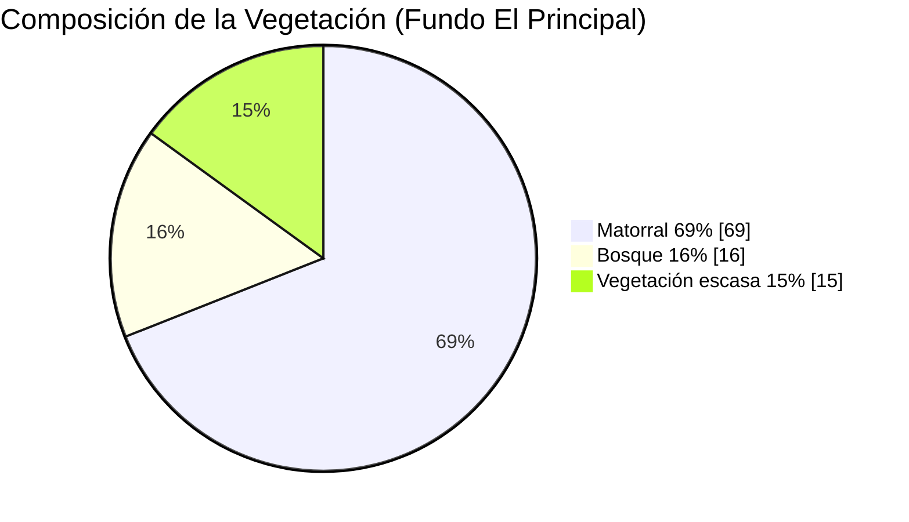

# Infografía – Flora y Comunidades Vegetales (Markdown export)

> Esta es la versión **.md** lista para descargar/copiar. Simplemente guarda este texto en un archivo llamado `infografia_flora_vegetacion.md`.

---

## 1. Composición de la Vegetación (cita 59)

**Leyenda**

* **Matorral**: 69 %
* **Bosque**: 16 %
* **Vegetación escasa**: 15 %

---

## 2. Flora Emblemática y Amenazada

| Especie                                            | Imagen                                                                                                                                                                                       | Crédito                                        |
| -------------------------------------------------- | -------------------------------------------------------------------------------------------------------------------------------------------------------------------------------------------- | ---------------------------------------------- |
| *Austrocactus spiniflorus*                         |                                                                               | Vicente Figueroa – CC0 (Wikimedia Commons)     |
| *Placea arzae*                                     |                                                                                                         | Dick Culbert – CC BY 2.0 (Wikimedia Commons)   |
| Guayacán (*Porlieria chilensis*)                   |  | Inao Vasquez – CC BY 4.0 (Wikimedia Commons)   |
| Lingue (*Persea lingue*)                           |                                                                     | Patricio Novoa – CC BY 2.0 (Wikimedia Commons) |
| Ciprés de la Cordillera (*Austrocedrus chilensis*) |                                                                       | Gagea – CC BY SA 3.0 (Wikimedia Commons)       |

---

### Notas técnicas

* El gráfico de dona está en **Mermaid**; asegúrate de que el visor de Markdown soporte Mermaid (GitHub, Obsidian con plugin, VS Code con extensión, etc.).
* Las imágenes se referencian desde Wikimedia Commons. Para publicar o imprimir, descarga los archivos y acredita según sus licencias.
* Mantén la cita "(cita 59)" al reutilizar el gráfico en otros contextos.

---

\*Exp
